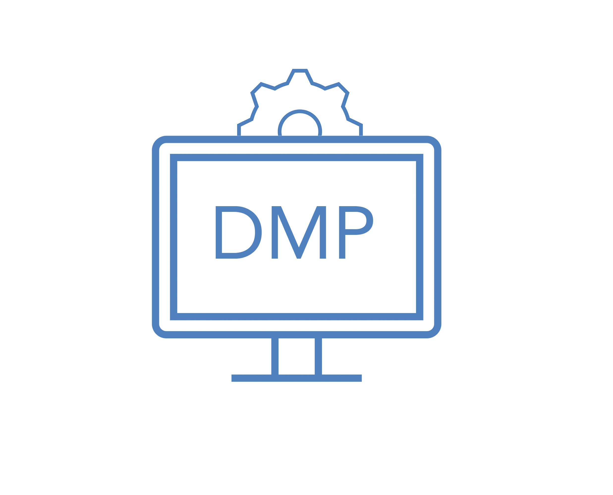

 

Data Management Plans (DMP), an Introduction

- Pre-workshop activities: 15 min 
- Presentation: 39 min

## Why Data Management Plans (DMP)? 

A Data Management Plan (DMP) is a formal and evolving document that outlines the practices, processes, and strategies of the data you expect to acquire or generate during the course of a research project.

By completing a DMP you will be working towards:

•    Setting out consistent strategies for how your data will be managed
•    Identifying strengths and weaknesses in your current practices 
•    Preparing the data for future reuse, preservation, and sharing
•    Reducing the overall cost of research by increasing project efficiencies

 [DMP Assistant](https://assistant.portagenetwork.ca/){:target="_blank"} is a national, online, bilingual data management planning tool developed by the Portage Network in collaboration with host institution University of Alberta to assist researchers in preparing data management plans (DMPs). This tool is freely available to all researchers, and develops a DMP through a series of key data management questions, supported by best-practice guidance and examples.

DMPs are one of the foundations of good research data management (RDM), an international best practice, and increasingly required by institutions and funders. For example, they are a pillar of the Canadian Tri-Agency Research Data Management Policy.
 
 [Taguette](https://taguette.org/) a user-friendly and free web-based tool that helps researchers to code and analyse their qualitative data. Taguette is a great tool for those who need to analyze interviews, reports, transcripts of any kinds, and a variety of text. With the tool, we can create codes and analyse texts easily and export in different file formats. If you have some or a lot of text to analyse, Taguette might be a great option for you.

This workshop uses the OpenSource _Taguette_ software because it is free to use and many find it easier to learn than [other popular commercial software packages](https://en.wikipedia.org/wiki/Computer-assisted_qualitative_data_analysis_software){:target="_blank"}. 

This workshop is not an endorsement of Taguette; there are many options for qualitative analysis and coding and other software may be better in other contexts. While an excellent teaching tool, _Taguette_ imposes some limitations that users should be aware of:

- Only text can be coded. For example videos and images can not be coded.
- Passanges coded with different tags have the same colour in Taguette. 
- Only basic analysis can be done in Taguette. External tools, like Microsoft Excel, can be used for more advanced analysis are covered in this workshop.

## Learning objectives - UPDATE FOR THE NEW TOOL

At the end of this workshop, you will be able to:

1. Identify the differences between manual coding and coding with qualitative coding software
2. Use Taguette on either their personal computer or on a cloud-based server
3. Will have coded at least two texts of their choosing (interviews, speeches, lectures, announcements, etc.) using techniques covered in the workshop
4. Will have research materials with codes and have exported them
5. Created a basic analysis of coded data in Excel
 
[NEXT STEP: Pre-Workshop Activities](pre-workshop.html){: .btn .btn-blue }
